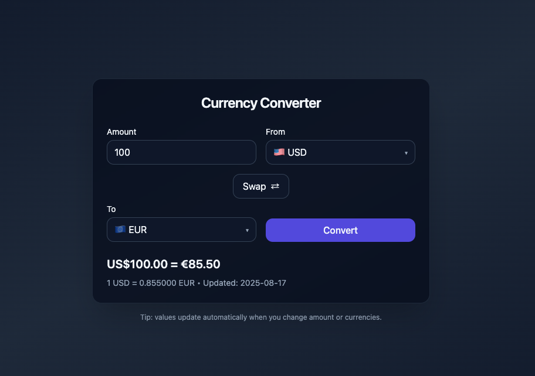

# 💱 Currency Converter | Conversor de Moedas  

[](https://developer.mozilla.org/en-US/docs/Web/JavaScript)
[](https://tailwindcss.com/)
[](LICENSE)

A simple and elegant currency converter built with **JavaScript**, **Tailwind CSS**, and a free **Exchange Rate API**.  
Um conversor de moedas simples e elegante feito com **JavaScript**, **Tailwind CSS** e uma **API gratuita de câmbio**.  

---

## 🌍 Preview | Pré-visualização




---

## 🚀 Features | Funcionalidades

- 🇬🇧 **English**
  - Real-time currency conversion using an external API  
  - Swap button to invert currencies  
  - Automatic conversion when changing values or currencies  
  - Currency flags for better visualization  
  - Modern and responsive UI with TailwindCSS  

- 🇧🇷 **Português**
  - Conversão de moedas em tempo real usando API externa  
  - Botão de troca para inverter moedas  
  - Conversão automática ao alterar valores ou moedas  
  - Bandeiras para facilitar visualização das moedas  
  - Interface moderna e responsiva com TailwindCSS  

---

## 🛠️ Technologies | Tecnologias

- **HTML5**
- **JavaScript (ES6+)**
- **Tailwind CSS**
- **ExchangeRate API**

---

## 📦 Installation | Instalação

- 🇬🇧 **English**
  1. Clone this repository  
     ```bash
     git clone https://github.com/brunolagaris/currency-converter.git
     cd currency-converter
     ```
  2. Open `index.html` in your browser  

- 🇧🇷 **Português**
  1. Clone este repositório  
     ```bash
     git clone https://github.com/brunolagaris/currency-converter.git
     cd currency-converter
     ```
  2. Abra o arquivo `index.html` no navegador  

---

## 🎨 Customization | Personalização

- 🇬🇧 Replace the API with any other currency provider.  
- 🇧🇷 Substitua a API por qualquer outro provedor de câmbio.  

- 🇬🇧 Add more flags by editing `currencyFlag` in `script.js`.  
- 🇧�� Adicione mais bandeiras editando `currencyFlag` em `script.js`.  

---

## 🤝 Contributing | Contribuindo

- 🇬🇧 Pull requests are welcome. For major changes, please open an issue first.  
- 🇧🇷 Contribuições são bem-vindas. Para mudanças maiores, abra primeiro uma *issue*.  

---

## 📜 License | Licença

This project is under the [MIT License](LICENSE).  
Este projeto está sob a [Licença MIT](LICENSE).  

---

## ✨ Author | Autor

👨‍💻 Developed by **[Bruno Lagaris](https://github.com/brunolagaris)**  
👨‍💻 Desenvolvido por **[Bruno Lagaris](https://github.com/prunolagaris)**

